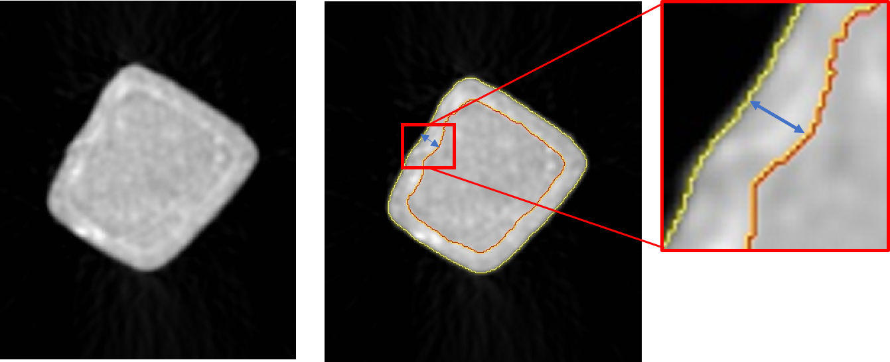
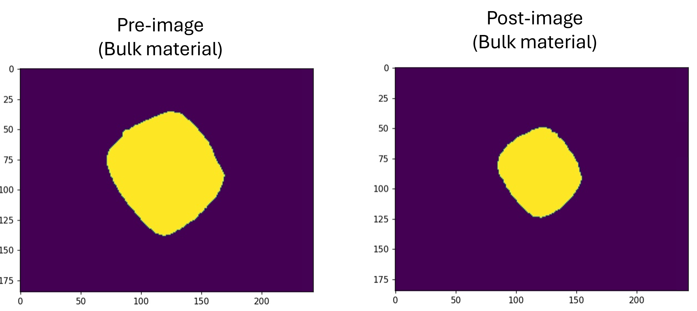
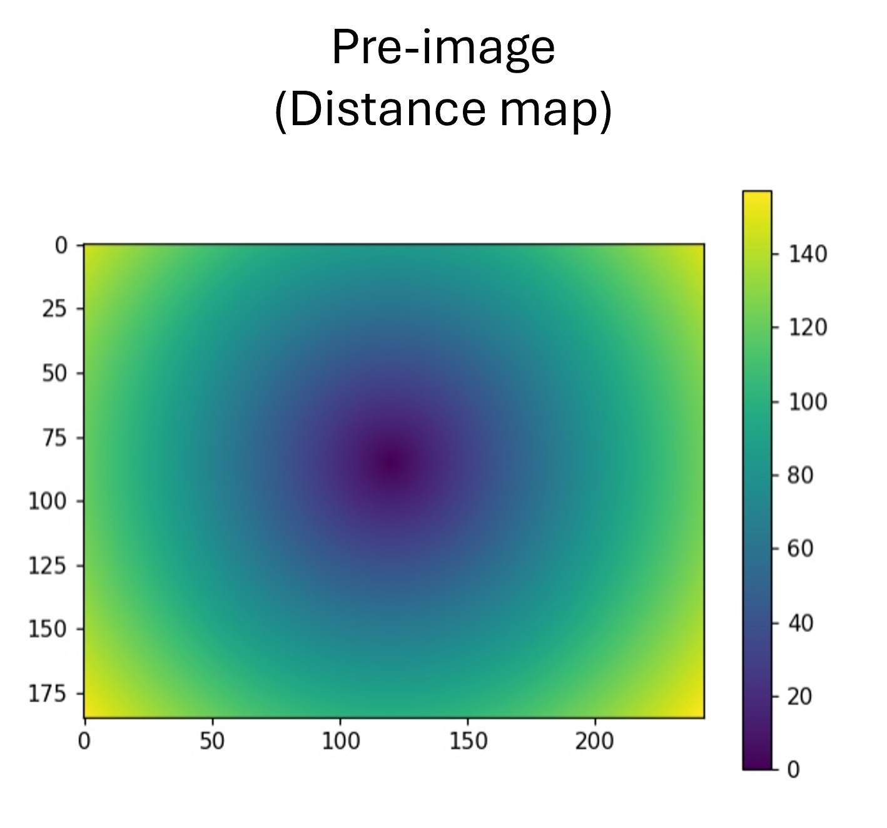
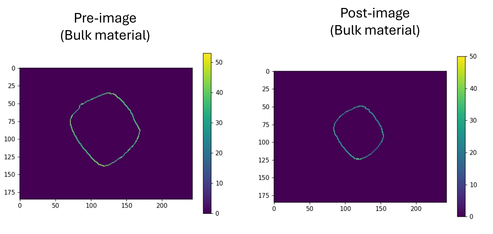

# Pittingfactor calculation for degraded wire's
```
Usage: Used to calculate the Pitting factor of degraded wires for Micro-CT Image data

Input: 2D-Tif Image data 
Output: 2D/3D Pittingfactor, Mean Degradation Depth and Deepest Pit per slice

Written by: Sven Schimek, André Lopes Marinho
Contact. sven.schimek@hereon.de
Update: 08.07.24
Copyright: Helmholtz-Zentrum Hereon
```
## What is the pitting factor?

The pittingfactor (PF) describes the homogenity of the degradation and the occurrence of localised surface degradations. The pittingfactor is calculated as the deepest pit (DP) divided by the mean degradation depth (MDD):

$PF=DP/MDD$

The following code will use the segmentation of the non degraded and degraded wire to calculate the distances between the bulk material layers in order to generate the DP and MDD information. A illustration of the workflow is shown in the following image:
<div style="text-align: center;">
  
</div>

## Workflow of the code
To run the script the segmentated images of the non degraded wire (pre-image) and the degraded wire (target-image) are required as 2D-tif data. 
```
1. In the first step, the bulk material of the pre-images will be loaded and transformed into a 3D NumPy array.
 ```

<div style="text-align: center;">
  
</div>

```
2. After this, the midpoint of the wire will be calculated, and a distance map will be generated. This distance map will later on be used to link the distances with the corresponding pixels of the surfaces.
```
<div style="text-align: center;">
  
</div>

```
3. To determine the distances of the surface of the non-degraded wire, the surface of the bulk material must be extracted. This involves isolating the bulk label that are in contact with the background label. Subsequently, these surface pixels are combined with the distance map to create the surface_distance map
```
<div style="text-align: center;">
  
</div>

```
4. This workflow will be repeated for the target image. To ensure the comparability of the distances and account for effects such as material loss, the distance map of the pre-image will be used to generate the surface_distance_target map.
```

```
5. Based on the extracted surface pixels and distance information, the distances between the surfaces can be calculated. This is done by combining each pixel of the target image surface with the closest pixel of the pre-image surface. Using the distance information of these pixels, the distance between the surfaces can be determined.
```
In order to calculate the 2D-PF, the deepest pit (the greatest distance) and the mean degradation depth (the average value of the detected distances) will be used, based on every slide/image of the sample.

$2D~PF=DP_i/MDD_i$, i is the value of the slide

The 3D-PF assess the overall deepest pit along with the overall mean degradation depth.

$3D~PF=DP_{i-max}/MDD_{i-mean}$


